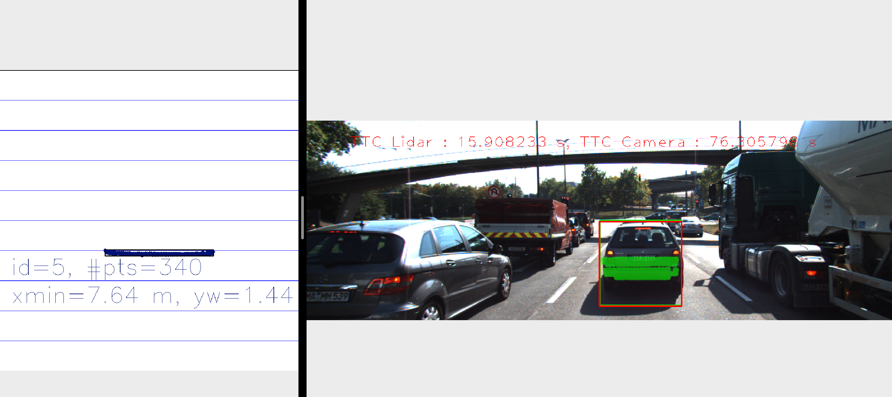

# SFND 3D Object Tracking

Welcome to the final project of the camera course. By completing all the lessons, you now have a solid understanding of keypoint detectors, descriptors, and methods to match them between successive images. Also, you know how to detect objects in an image using the YOLO deep-learning framework. And finally, you know how to associate regions in a camera image with Lidar points in 3D space. Let's take a look at our program schematic to see what we already have accomplished and what's still missing.


In this final project, you will implement the missing parts in the schematic. To do this, you will complete four major tasks: 
1. First, you will develop a way to match 3D objects over time by using keypoint correspondences. 
2. Second, you will compute the TTC based on Lidar measurements. 
3. You will then proceed to do the same using the camera, which requires to first associate keypoint matches to regions of interest and then to compute the TTC based on those matches. 
4. And lastly, you will conduct various tests with the framework. Your goal is to identify the most suitable detector/descriptor combination for TTC estimation and also to search for problems that can lead to faulty measurements by the camera or Lidar sensor. In the last course of this Nanodegree, you will learn about the Kalman filter, which is a great way to combine the two independent TTC measurements into an improved version which is much more reliable than a single sensor alone can be. But before we think about such things, let us focus on your final project in the camera course. 

## Dependencies for Running Locally
* cmake >= 2.8
  * All OSes: [click here for installation instructions](https://cmake.org/install/)
* make >= 4.1 (Linux, Mac), 3.81 (Windows)
  * Linux: make is installed by default on most Linux distros
  * Mac: [install Xcode command line tools to get make](https://developer.apple.com/xcode/features/)
  * Windows: [Click here for installation instructions](http://gnuwin32.sourceforge.net/packages/make.htm)
* Git LFS
  * Weight files are handled using [LFS](https://git-lfs.github.com/)
* OpenCV >= 4.1
  * This must be compiled from source using the `-D OPENCV_ENABLE_NONFREE=ON` cmake flag for testing the SIFT and SURF detectors.
  * The OpenCV 4.1.0 source code can be found [here](https://github.com/opencv/opencv/tree/4.1.0)
* gcc/g++ >= 5.4
  * Linux: gcc / g++ is installed by default on most Linux distros
  * Mac: same deal as make - [install Xcode command line tools](https://developer.apple.com/xcode/features/)
  * Windows: recommend using [MinGW](http://www.mingw.org/)

## Basic Build Instructions

1. Clone this repo.
2. Make a build directory in the top level project directory: `mkdir build && cd build`
3. Compile: `cmake .. && make`
4. Run it: `./3D_object_tracking`.

## [Rubric](https://review.udacity.com/#!/rubrics/2550/view) Points

### FP.1 Match 3D Objects
#### Criteria
Implement the method "matchBoundingBoxes", which takes as input both the previous and the current data frames and provides as output the ids of the matched regions of interest (the boxID property). Matches must be the ones with the highest number of keypoint correspondences.

#### Solution
##### method1
1. For each keypoint match, use the id of boundingBoxes containing this keypoint in previous frame as the key, store the id of boundingBoxes containing this keypoint in current frame in a multiset. 
2. For each found boundingBox with one or more matched keypoints in previous frame, choose the best boundingBox in current frame with the highest number of keypoint. Then store this matched bb in bbBestMatches.

##### method2
Here method2 was choosen, for it's much easier to understand. 
1. Loop through bb in previous frame, find related bounding boxes in current frame that both bb in previous frame and current frame contain same keypoint. 
2. Find the best match bounding box in current frame that contains the highest number of matched keypoint

```
void matchBoundingBoxes(std::vector<cv::DMatch> &matches, std::map<int, int> &bbBestMatches, DataFrame &prevFrame, DataFrame &currFrame)
{
    // method 1:
    // std::map<int, std::multiset<int>> multiBBmatches;
    // for (const auto& match : matches) {
    //     cv::KeyPoint prevKpt = prevFrame.keypoints[match.queryIdx];
    //     cv::KeyPoint currKpt = currFrame.keypoints[match.trainIdx]; 
    //     std::vector<int> prevIds, currIds; 
    //     for (const auto& box : prevFrame.boundingBoxes) {
    //         if (box.roi.contains(prevKpt.pt))
    //             prevIds.push_back(box.boxID); 
    //     }
    //     for (const auto& box : currFrame.boundingBoxes) {
    //         if (box.roi.contains(prevKpt.pt))
    //             currIds.push_back(box.boxID); 
    //     }
        
    //     for (auto prevId : prevIds) {
    //         for (auto currId : currIds) {
    //             // finding all matched bounding boxes if both bb for prev and curr frame contain matched keypoint 
    //             multiBBmatches[prevId].insert(currId);
    //         }
    //     }
    // }

    // for (auto bbMatches : multiBBmatches) {
    //     int bestCurrId = 0, maxCount = 0;
    //     // for each matched bb in previous frame, choose the best-bb in current frame that contains the most number of matched keypoints 
    //     for (auto it = bbMatches.second.begin(); it != bbMatches.second.end(); ++it) {
    //         int count = bbMatches.second.count(*it);
    //         if (count > maxCount) {
    //             bestCurrId = *it; 
    //             maxCount = count;
    //         }

    //     }
    //     if (maxCount) {
    //         bbBestMatches.insert({bbMatches.first, bestCurrId}); 
    //         std::cout << "match times: " << maxCount << " prevId: " << bbMatches.first << " currId: " << bestCurrId << std::endl;
    //     }
    // }


    // method 2:
    // loop for bounding box in previous frame 
    for (const auto& prevBb : prevFrame.boundingBoxes) {
        // find related bounding boxes in current frame that both bb in previous frame and current frame contain same keypoint
        std::multiset<int> currBbIds; 
        // loop for matched keypoints 
        for (const auto& match : matches) {
            cv::KeyPoint prevKpt = prevFrame.keypoints[match.queryIdx];
            cv::KeyPoint currKpt = currFrame.keypoints[match.trainIdx]; 
            if (!prevBb.roi.contains(prevKpt.pt)) {
                continue; // skip this match if the prevBb doesn't contain this keypoint
            }
            // loop for bounding box in current frame 
            for (const auto& currBb : currFrame.boundingBoxes) {
                if (!currBb.roi.contains(currKpt.pt)) {
                    continue; // skip this bb if currBb doesn't contain this keypoint
                }
                currBbIds.insert(currBb.boxID); 
            }

        }

        // find the best match bounding box in current frame that contains the highest number of matched keypoint
        int bestCurrId = 0, maxCount = 0;
        for (auto it = currBbIds.begin(); it != currBbIds.end(); ++it) {
            int count = currBbIds.count(*it);
            if (count > maxCount) {
                bestCurrId = *it; 
                maxCount = count;
            }
        }
        if (maxCount) {
            bbBestMatches.insert({prevBb.boxID, bestCurrId}); 
            std::cout << "match times: " << maxCount << " prevId: " << prevBb.boxID << " currId: " << bestCurrId << std::endl;
        }
    }
}
```

### FP.2 Compute Lidar-based TTC
#### Criteria
Compute the time-to-collision in second for all matched 3D objects using only Lidar measurements from the matched bounding boxes between current and previous frame.

#### Solution
##### The Math Behind Time-to-Collision (TTC)
In the following, let us assume that our CAS-equipped vehicle is using a Lidar sensor to take distance measurements on preceding vehicles. The sensor in this scenario will give us the distance to the closest 3D point in the path of driving. In the figure below, the closest point is indicated by a red line emanating from a Lidar sensor on top of the CAS vehicle.
<p align = "center">
  
</p>
[From Udacity]

Based on a constant-velocity model, TTC can be computed from two successive Lidar measurements as follows:
<p align = "center">
  
</p>
[From Udacity]

##### Computing TTC from Distance Measurements

In order to compute the TTC, we need to find the distance to the closest Lidar point in the path of driving. In the figure below, Lidar measurements located on the tailgate of the preceding vehicle are measured at times t0(green) and t1(red). It can be seen, that the distance to the vehicle has decreased slightly between both time instants.
<p align = "center">
  
</p>
[From Udacity]

Even though Lidar is a reliable sensor, erroneous measurements may still occur. As seen in the figure above, a small number of points is located behind the tailgate, seemingly without connection to the vehicle. When searching for the closest points, such measurements will pose a problem as the estimated distance will be too small. There are ways to avoid such errors by post-processing the point cloud, but there will be no guarantee that such problems will never occur in practice. In my implementation, the median point in x_direction is choosen as the targeted lidar point to make the estimation more robust. 

```
double getMedianXDirection(std::vector<LidarPoint> &lidarPoints) {
    std::sort(lidarPoints.begin(), lidarPoints.end(), [](LidarPoint &pt1, LidarPoint &pt2) {
        return pt1.x < pt2.x;
    });
    if (lidarPoints.empty()) 
        return NAN; 
    int medianIdx = floor(lidarPoints.size() / 2.0); 
    double medianX = lidarPoints.size() % 2 == 0 ? (lidarPoints[medianIdx - 1].x + lidarPoints[medianIdx].x) / 2.0 : lidarPoints[medianIdx].x; 
    return lidarPoints[lidarPoints.size() / 2].x; 
}


void computeTTCLidar(std::vector<LidarPoint> &lidarPointsPrev,
                     std::vector<LidarPoint> &lidarPointsCurr, double frameRate, double &TTC)
{
    cout << "lidarPointsPrev size=" << lidarPointsPrev.size() << endl;
    cout << "lidarPointsCurr size=" << lidarPointsCurr.size() << endl;

    double medianXPrev = getMedianXDirection(lidarPointsPrev);
    double medianXCurr = getMedianXDirection(lidarPointsCurr);
    double dT = 1.0 / frameRate;

    cout << "medianXPrev=" << medianXPrev << endl;
    cout << "medianXCurr=" << medianXCurr << endl;

    TTC = medianXCurr * dT / (medianXPrev - medianXCurr);
}
```

### FP.3 Associate Keypoint Correspondences with Bounding Boxes
#### Criteria
Prepare the TTC computation based on camera measurements by associating keypoint correspondences to the bounding boxes which enclose them. All matches which satisfy this condition must be added to a vector in the respective bounding box.

#### Solution
Find all keypoint matches which are enclosed by the bounding box. Filter these keypoints by removing those with large match distance. 

```
// associate a given bounding box with the keypoints it contains
void clusterKptMatchesWithROI(BoundingBox &boundingBox, std::vector<cv::KeyPoint> &kptsPrev, std::vector<cv::KeyPoint> &kptsCurr, std::vector<cv::DMatch> &kptMatches)
{
    std::vector<cv::DMatch> kptMatchesRoi; 
    for (auto match : kptMatches) {
        if (boundingBox.roi.contains(kptsCurr[match.trainIdx].pt)) {
            kptMatchesRoi.push_back(match); 
        }
    }
    if (kptMatchesRoi.empty()) 
        return; 

    // filter matches 
    double accumulatedDist = 0.0; 
    for  (auto it = kptMatchesRoi.begin(); it != kptMatchesRoi.end(); ++it)  
         accumulatedDist += it->distance; 
    double meanDist = accumulatedDist / kptMatchesRoi.size();  
    double threshold = meanDist * 0.7;        
    for  (auto it = kptMatchesRoi.begin(); it != kptMatchesRoi.end(); ++it)
    {
       if (it->distance < threshold)
           boundingBox.kptMatches.push_back(*it);
    }
    cout << "Leave " << boundingBox.kptMatches.size()  << " matches" << endl;
}
```

### FP.4 Compute Camera-based TTC
#### Criteria
Compute the time-to-collision in second for all matched 3D objects using only keypoint correspondences from the matched bounding boxes between current and previous frame.

#### Solution
##### Measuring TTC without distance
Based on the constant velocity motion model, in the following figure, you can see how the height HH of the preceding vehicle can be mapped onto the image plane using perspective projection. We can see that the same height HH maps to different heights h_0 and h_1 in the image plane, depending on the distance d_0 and d_1 of the vehicle. It is obvious that there is a geometric relation between hh, HH, dd and the focal length ff of the pinhole camera - and this is what we want to exploit in the following.

<p align = "center">
  
</p>
[From Udacity]

<p align = "center">
  
</p>
[From Udacity]

<p align = "center">
  
</p>
[From Udacity]

In (a), a set of keypoints has been detected and the relative distances between keypoints 1-7 have been computed. In (b), 4 keypoints have been matched between successive images (with keypoint 3 being a mismatch) using a higher-dimensional similarity measure called descriptor. The ratio of all relative distances between each other can be used to compute a reliable TTC estimate by replacing the height ratio with the mean or median of all distance ratios.

```
// Compute time-to-collision (TTC) based on keypoint correspondences in successive images
void computeTTCCamera(std::vector<cv::KeyPoint> &kptsPrev, std::vector<cv::KeyPoint> &kptsCurr, 
                      std::vector<cv::DMatch> kptMatches, double frameRate, double &TTC, cv::Mat *visImg)
{
    // compute distance ratios between all matched keypoints
    vector<double> distRatios; // stores the distance ratios for all keypoints between curr. and prev. frame
    for (auto it1 = kptMatches.begin(); it1 != kptMatches.end() - 1; ++it1)
    { // outer kpt. loop

        // get current keypoint and its matched partner in the prev. frame
        cv::KeyPoint kpOuterCurr = kptsCurr.at(it1->trainIdx);
        cv::KeyPoint kpOuterPrev = kptsPrev.at(it1->queryIdx);

        for (auto it2 = kptMatches.begin() + 1; it2 != kptMatches.end(); ++it2)
        { // inner kpt.-loop

            double minDist = 100.0; // min. required distance

            // get next keypoint and its matched partner in the prev. frame
            cv::KeyPoint kpInnerCurr = kptsCurr.at(it2->trainIdx);
            cv::KeyPoint kpInnerPrev = kptsPrev.at(it2->queryIdx);

            // compute distances and distance ratios
            double distCurr = cv::norm(kpOuterCurr.pt - kpInnerCurr.pt);
            double distPrev = cv::norm(kpOuterPrev.pt - kpInnerPrev.pt);

            if (distPrev > std::numeric_limits<double>::epsilon() && distCurr >= minDist)
            { // avoid division by zero

                double distRatio = distCurr / distPrev;
                distRatios.push_back(distRatio);
            }
        } // eof inner loop over all matched kpts
    }     // eof outer loop over all matched kpts

    cout << "distRatios size=" << distRatios.size() << endl;
    // only continue if list of distance ratios is not empty
    if (distRatios.size() == 0)
    {
        TTC = NAN;
        return;
    }

    std::sort(distRatios.begin(), distRatios.end());
    long medIndex = floor(distRatios.size() / 2.0);
    double medDistRatio = distRatios.size() % 2 == 0 ? (distRatios[medIndex - 1] + distRatios[medIndex]) / 2.0 : distRatios[medIndex]; // compute median dist. ratio to remove outlier influence

    double dT = 1 / frameRate;
    TTC = -dT / (1 - medDistRatio);

    cout << "medDistRatio=" << medDistRatio << endl; 
}
```

### FP.5 Performance Evaluation 1
#### Criteria
Find examples where the TTC estimate of the Lidar sensor does not seem plausible. Describe your observations and provide a sound argumentation why you think this happened.

#### Solution
<p align = "center">
  
</p>

<p align = "center">
  
</p>

<p align = "center">
  
</p>

As can be seen from above images, TTC estimation is very unstable, although they are adjacent frames. In order to reject the outliers and make the estimation more robust, the median point in x_direction is choosen as the targeted lidar point for TTC calculation. 
```
TTC = medianXCurr * dT / (medianXPrev - medianXCurr);
```
There is a red light in front and the speed of cars are all slow or even close to zero. Therefore, the delta of medianXPrev and medianXCurr is extremely small. This will cause the TTC estimiation unstable. 

### FP.6 Performance Evaluation 2
#### Criteria
Run several detector/descriptor combinations and look at the differences in TTC estimation. Find out which methods perform best and also include several examples where camera-based TTC estimation is way off. As with Lidar, describe your observations again and also look into potential reasons.

#### Solution
Results of TTC estimation for three detector/descriptor combinations: 
##### [FAST + BRIEF](https://github.com/Junzhuodu/SFND_3D_Object_Tracking/tree/master/results/result1.txt)

|    LiDAR TTC (sec) |    Camera TTC (sec) | Delta (sec)  |
|        ---         |       ---           |      ---     |
|      12.5          |     11.8            |       0.7    |
|      12.6          |     11.2            |       1.4    |
|      14.1          |       13.6          |       0.5    |
|        16.7        |      13.1           |        3.6   |
|       15.9         |       76.3          |       60.4   |
|       12.7         |       13.1          |       0.4    |
|      12.0          |       13.5          |       1.5    |
|       13.1         |       11.2          |       1.9    |
|     13.0           |       11.9          |       1.1    |
|      11.2          |       13.3          |       2.1    |

<br>

Average delta_t between Lidar TTC and Camera TTC is 7.36s.

##### [FAST + ORB](https://github.com/Junzhuodu/SFND_3D_Object_Tracking/tree/master/results/result2.txt)

|     LiDAR TTC (sec) |    Camera TTC (sec) | Delta (sec)  |
|        ---          |       ---           |     ---      |
|      12.5           |     10.5            |     2.0      |
|      12.6           |     13.0            |     0.4      | 
|      14.1           |       16.6          |     2.5      |
|        16.7         |      15.0           |     1.7      |
|       15.9          |       39.4          |     23.5     |
|       12.7          |       12.4          |     0.3      |
|      12.0           |       11.8          |     0.2      |
|       13.1          |       12.2          |     0.9      |
|     13.0            |       11.8          |     1.2      |
|      11.2           |       13.5          |     2.3      |

<br>

Average delta_t between Lidar TTC and Camera TTC is 3.5s.

##### [SHITOMASI + BRIEF](https://github.com/Junzhuodu/SFND_3D_Object_Tracking/tree/master/results/result3.txt)

|     LiDAR TTC (sec) |    Camera TTC (sec) | Delta (sec)   |
|        ---          |       ---           |     ---       |
|      12.5           |     13.1            |     0.6       |
|      12.6           |     19.2            |     6.6       |
|      14.1           |       11.1          |     3.0       |
|        16.7         |      11.6           |     5.1       |
|       15.9          |       12.7          |     3.2       |
|       12.7          |       13.4          |     0.7       |
|      12.0           |       13.6          |     1.6       |
|       13.1          |       14.2          |     1.1       |
|     13.0            |       11.4          |     1.6       |
|      11.2           |       12.8          |     1.6       |

Average delta_t between Lidar TTC and Camera TTC is 2.51s. 

##### Recommendation 
In balance of speed and accuracy, I would recommend FAST/ORB combination as the first choice. 

<p align = "center">
  
</p>

<p align = "center">
  
</p>

As shown above, camera-based TTC estimation is obviously incorrect in these scenarios. If there are some mismatches, it will impact our TTC calculation. And also, if the relative speed between our car and the prepreceding vehicle is very small or the environment impact, the distance ratio will become close to 1, this will cause TTC to inf. 
Therefore, both camera-based TTC or lidar-based TTC are not always correct or stable. In order to get a more robust TTC estimation, we need fusion these sensors. 
